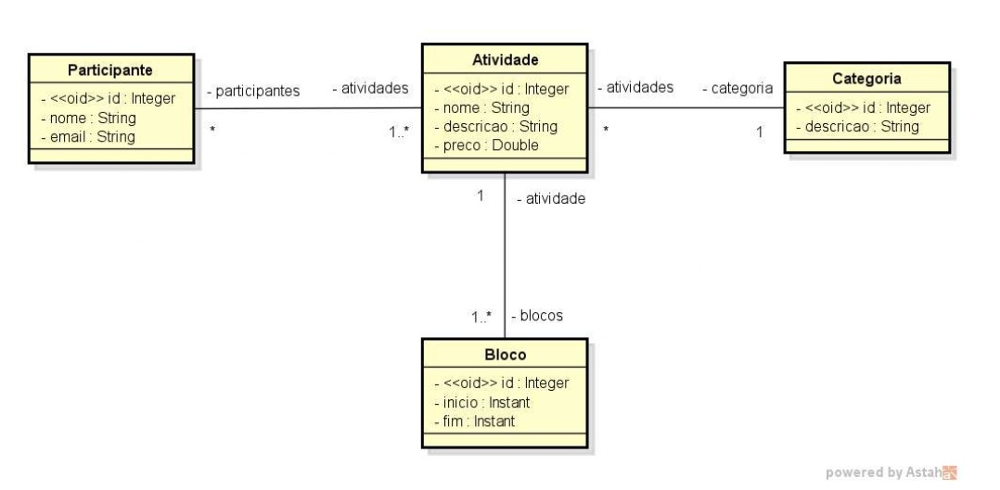
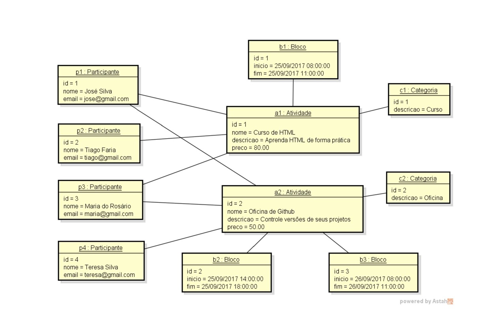

# Evento — Modelo de Domínio e ORM (Desafio)

Projeto curto para modelar e mapear, com JPA/Hibernate, o domínio de um **evento** composto por **Participantes**, **Atividades**, **Categorias** e **Blocos** de horário. A proposta foi **definir o modelo**, **mapear os relacionamentos** e **inserir dados de exemplo (seed)** para ilustrar as ligações.

## Modelo de domínio

*Entidades e relações do sistema.*

**Entidades**
- Participante: `id`, `nome`, `email`
- Atividade: `id`, `nome`, `descricao`, `preco`
- Categoria: `id`, `descricao`
- Bloco: `id`, `inicio`, `fim` (usando `Instant`)

**Relacionamentos**
- Participante ↔ Atividade: muitos-para-muitos (inscrições)
- Atividade → Categoria: muitos-para-um (cada atividade pertence a uma categoria)
- Atividade → Bloco: um-para-muitos (uma atividade pode ter vários blocos)

## Instância de dados (seed)

*Conjunto de registros de exemplo e como se relacionam.*

## Tecnologias utilizadas
- **Java 21**
- **Spring Boot 3.5.4**
- **H2 Database**
- **Maven**